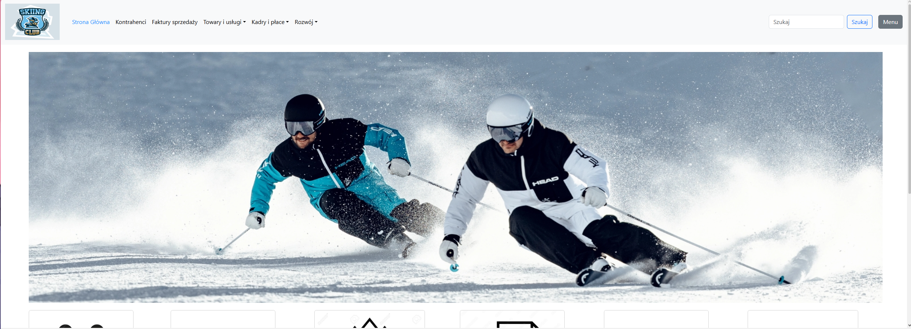
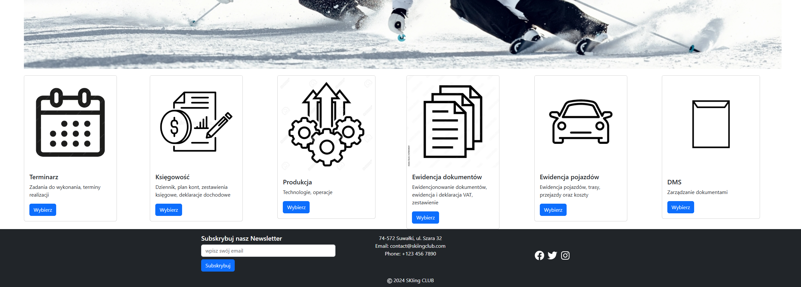
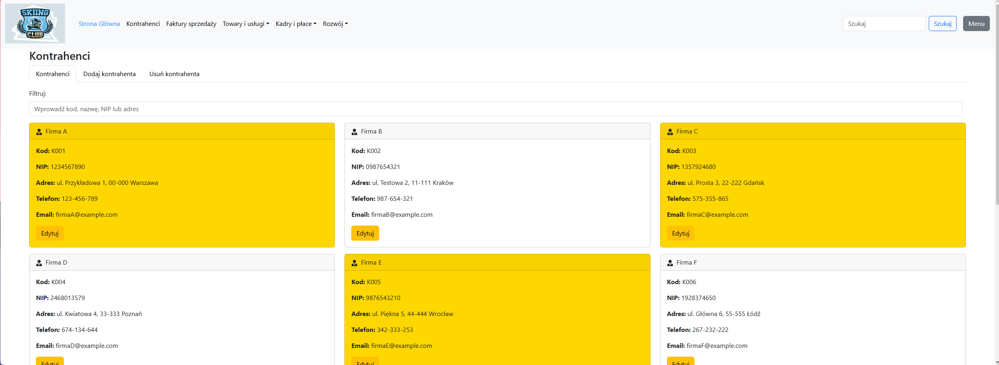
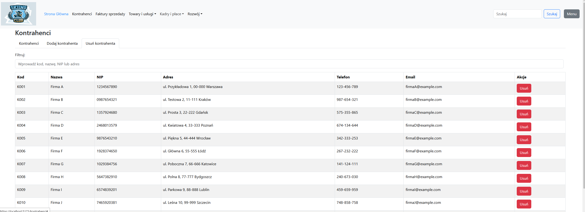
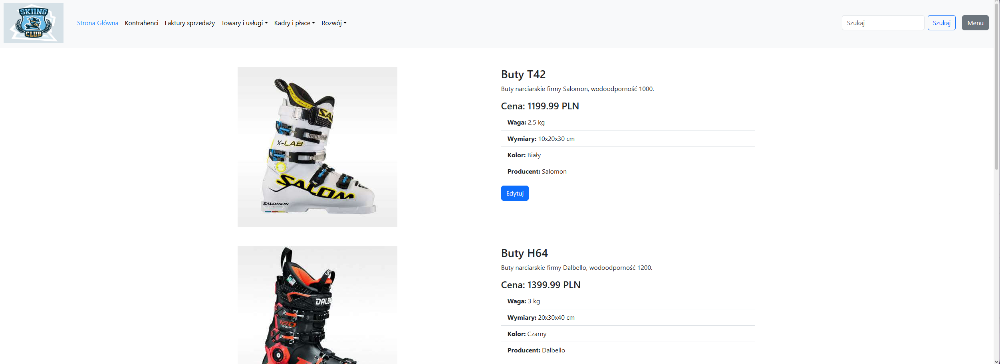
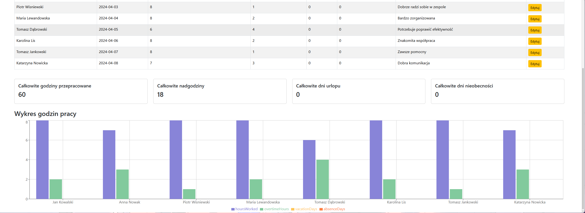
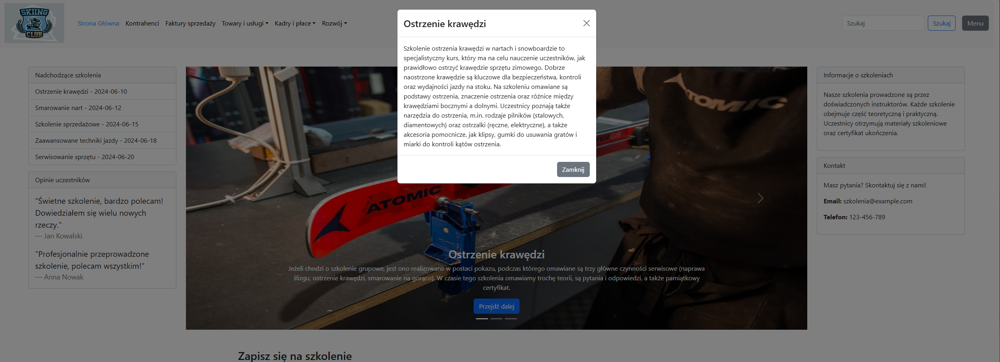

## ReactApp (frontend + server)

**Company management dashboard (ERP-lite) – demo frontend.**

The UI is designed as an admin-style app for managing day-to-day company data (products, employees, invoices, reports, etc.). It’s currently a **frontend-focused demo** (mock data / in-memory state), with a server project included for future API work.

This repository contains:

- **React + TypeScript (Vite) frontend** in `reactapp.client/`
- **ASP.NET Core server** in `ReactApp.Server/` (serves static files + API endpoints via `Controllers`)

### Demo modules (high level)

- Products: list, filters, details, reports
- Employees: list, create form, payroll/reports (demo)
- Business partners, invoices, returns, account/support pages (demo)

### Structure

- **`ReactApp.sln`**: Visual Studio solution
- **`reactapp.client/`**: frontend app (Vite)
- **`ReactApp.Server/`**: backend/server (ASP.NET Core)
- **`assets/screenshots/`**: screenshots for docs/README

### Requirements

- Node.js (LTS)
- npm (bundled with Node)
- .NET SDK (for `ReactApp.Server/`)

### Run (frontend)

From `reactapp.client/`:

```bash
npm install
npm run dev
```

Production build:

```bash
npm run build
```

### Run (server)

From `ReactApp.Server/`:

```bash
dotnet run
```

### Screenshots

More screenshots are located in `assets/`

#### Home Page



#### Home Page2



#### Contactors



#### Delete Contactors



#### Product details



#### Reports



#### Trainings


